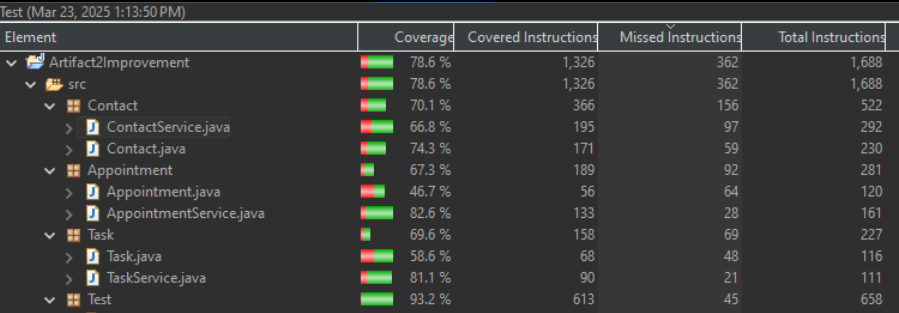
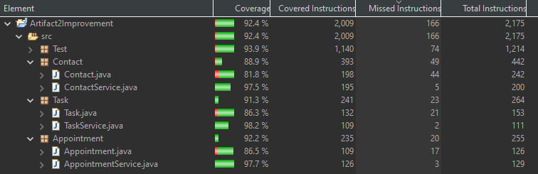

## CS-499 ePortfolio
April 17, 2025

### Introduction

Hello, my name is ShiAnn Rule and I have been in SNHU's Computer Science degree program since August 2021. This page is my final project for CS-499 Capstone and marks my completion of my Bachelor's degreee in Computer Science. 

### Professional Self Assessment

Completing the Computer Science Bachelors program has been a incredible growing experience, both academically and professionally. Over the course of the program, I have been able to refine the technical knowledge and skills essential to thrive in the computer science field. More importantly, I have gained a clearer understanding of my professional identity and career goals. This ePortfolio provided an opportunity to showcase what I have learned, highlight my technical competencies, and reflect on how my education has prepared me to contribute meaningully in a professional setting.

Throughout my coursework, I engaged with a broad range of topics that collectively contributed to my development as a well-rounded software development professional. I have learned to approach problems systematically and efficiently while addressing real-world challenges. The projects that I have completed during my time at SNHU have allowed me to think critically and design scalable solutions, which are vital skills in software development and systems design. Working through the full software development life cycle, from requirements gathering from stakeholders to deployment, I have become comfortable with version control systems such as Git, collaborative development tools, and agile methodologies. One particularly impactful project was Artifact One in this ePortfolio, where I designed a mobile application for a user to track their weight over time. This enhanced my understanding of UI development and the importance of a robust backend including multiple databases to support the application.

Cybersecurity has been a key focus area. Through hands-on practice and theoretical study, I have developed a solid foundation in secure coding practices. These skills are essential in today's technology landscape, where data breaches and system vulnerabilities can have serious consequences. By integrating security into each stage of development, I am confident in my ability to contibute to building systems that are both functional and secure. 

Equally important to technical proficiency is the ability to collaborate effectively in a team environment. The program emphasized the importance of teamwork, effective communication, and stakeholder involvement. It is important to be able to communicate effectively with stakeholders- both technical and not. I learned how to translate complex technical concepts into language that is accessible and relevant to the intended audience. This skill is crucial in bridging the gap between the development teams and business stakeholders and ensuring that technology solutions align with organizational goals.

As I prepare to enter the next phase of my career, I feel confident in my readiness to contribute meaningfully in the field of computer science. This program has given me a strong technical foundation and reinforced my commitment to lifelong learning, problem-solving, and professional integrity. 

In the following sections, you will find three examples of projects that I have completed in previous courses that I have improved using my skills in data strucutres, software engineering, and databases. You will find the projects both before and after the improvements as well as a thorough discussion of each artifact. These artifacts effectively showcase my skills that I have learned throughout my coursework at SNHU.

### Course Outcomes

In this ePortfolio I will demonstrate the following course outcomes:

- Employ strategies for building collaborative environments that enable diverse audiences to support organizational decision making in the field of computer science
- Design, develop, and deliver professional-quality oral, written, and visual communications that are coherent, technically sound, and appropriately adapted to specific audiences and contexts
- Design and evaluate computing solutions that solve a given problem using algorithmic principles and computer science practices and standards appropriate to its solution, while managing the trade-offs involved in design choices
- Demonstrate an ability to use well-founded and innovative techniques, skills, and tools in computing practices for the purpose of implementing computer solutions that deliver value and accomplish industry-specific goals
- Develop a security mindset that anticipates adversarial exploits in software architecture and designs to expose potential vulnerabilities, mitigate design flaws, and ensure privacy and enhanced security of data and resources

### Informal Code Review

The following code review contains all three artifacts shared in this portfolio. I go over each project separately discussing the existing functionality, any errors that will be corrected, and include what I plan to do to enhance the project.

### [CS-499 Code Review](https://youtu.be/S8QaOK-XVL4)

### Enhancement One: Software Design and Engineering

This artifact is a weight tracking application created in Android Studio utilizing Java for the base, XML for the UI, and SQLite for the database. It is an android application that allows a user to log their weight to track their weight over time, set a goal, receive notifications, and view their data in multiple ways. It was originally created in October 2024 for the SNHU CS-360 Mobile Architecture course. I selected this item because it is a full stack mobile application that I will be able to make significant improvements on and will be able to show my software engineering and design skills comprehensively.  

The main area that I chose to focus on to showcase my skills was the main activity of the application. In the main activity, the user has the option to add their weight and the date, and it displays the weight history in a grid format. This part of the application needed many improvements to make it more user-friendly and helpful. I swapped out the grid display of the weight history for a graph display which makes the data easier to view at a glance. I also made the date field auto generate for the current date so that the user doesn't have to enter the date themselves. This also allowed me to have better data so the graph could function properly. I moved the grid format to a separate page and added a button so the user could go view that information if they would like to. The final improvement I made was to create a check against the user’s goal weight each time they enter an updated weight. If they met or surpassed their goal, the app displays a congratulatory message letting them know that they reached their goal.  

The process of improving this application ended up being much more difficult than I anticipated. The biggest challenge was getting the graph set up. The resources that I could find online to educate myself on the GraphView library were limited. The primary challenge with setting up the graph was being able to have the X axis be dates and have them populate correctly with the corresponding data. It required me to rethink how a significant portion of my main activity and database operated and ended up requiring me to rebuild a significant portion of the way that it worked. I ended up finding it necessary to populate the date for the user which required me to also adjust how records were added to the database. Overall, with the research I was able to find and trying different techniques and troubleshooting them until I found what worked for my project, I was able to overcome this challenge and my application ended up better for it. 

View [Artifact One Original](https://github.com/shiolive/CS-499-Capstone/tree/e4031e29ec116995ef79e95cd68222fe4be04484/Artifacts/Artifact%20One/Artifact%20One%20Original).

View [Artifact One Enhancement](https://github.com/shiolive/CS-499-Capstone/tree/e4031e29ec116995ef79e95cd68222fe4be04484/Artifacts/Artifact%20One/Artifact%20One%20Improvement).

### Enhancement Two: Algorithms and Data Structures

This artifact is a JUnit test case on a CRUD Java application that interacts with a contact, appointment, and task creation system and validates the data entered and tests each function. It was originally created in April 2024 for CS-320 Software Testing course at SNHU. I included this in my portfolio because properly testing software is a vital part of any application and I believe it is an important skill. When I originally did this project in particular, I did not fully understand JUnit tests or the logic of software testing as a whole. Therefore, this project needed many revisions and was a great place for me to better my skills in building software tests. 

My plan was to increase the complexity of the application itself as well as the tests. I also planned to increase the coverage and fill the gaps in the tests to ensure that the application was well rounded and thoroughly tested. To complete this, I reviewed each java class alongside the associated test classes and identified numerous logic errors and gaps in the testing. A common error that I found were that I created the tests to test for successes in adding and updating the data, but I did not test to see if there were failures. By correcting this gap in logic, I was able to identify issues in the application structure itself as well. I corrected all of these errors and rewrote all of the tests for the program to make them more complex and more thorough. My coverage overall went from 78.6% to 92.7% with significant increases in coverage in the individual Java classes. 

Before Improvements: 

    
    
<em>Original test coverage- Before Enhancement</em>

After Improvements: 

    
    
<em>Test coverage after enhancement</em>

View [Artifact Two Original](https://github.com/shiolive/CS-499-Capstone/tree/main/Artifacts/Artifact%20Two/Artifact2Original/CS-320-main/CS320%20ProjectOne)

View [Artifact Two Enhancement](https://github.com/shiolive/CS-499-Capstone/tree/main/Artifacts/Artifact%20Two/Artifact2Improvement/Artifact2Improvement)

### Enhancement Three: Databases

This artifact was first created in August, 2024 for CS-340: Programming Concepts. This project utilizes a MongoDB database containing animal shelter records and outputs that data in a dashboard format that is available to interact with by filtering data, viewing a map to determine the locations of the animals and searching for animals that are meet the requirements for various rescue animal needs, such as water, disaster, and mountain rescues. I chose this project because the interaction with the database and the ability to search it was extremely limited and could be greatly improved upon. I wanted to improve the search functionality and the way that it displays in the graph on the dashboard and enhance the UI by giving the user the ability to add records on the dashboard, which is new functionality.  

I succeeded in improving the user interactions with the database by enhancing the search methods so they are more streamlined as well as adding the UI functionality to add new animals to the database. These improve the usability of the dashboard as well as the MongoDB itself. This functionality is important in an application like this one where the sole purpose is to interact with and manage database records.  

Diving back into this project, I had to refresh my knowledge of Python as it was one of the first languages I learned, but I have not interacted with it much except for this one class in several years. It was also difficult to setup to get functional because the original environment that I worked on it was a pre-built virtual machine that I had every tool already installed for me. The most difficult part of this project was making it functional to test the code on my own computer with limited memory of what tools were used and how to set them up again. This made me realize how important the proper IDE is and that I need to pay attention to the proper setups moving forward. Documentation on setting up these projects would help as well. Most classes require a README file to accompany the final projects but never suggested documenting the tools used in detail, which would be helpful in hindsight. 

View [Artifact Three Original]()

View [Artifact Three Enhancement] ()

